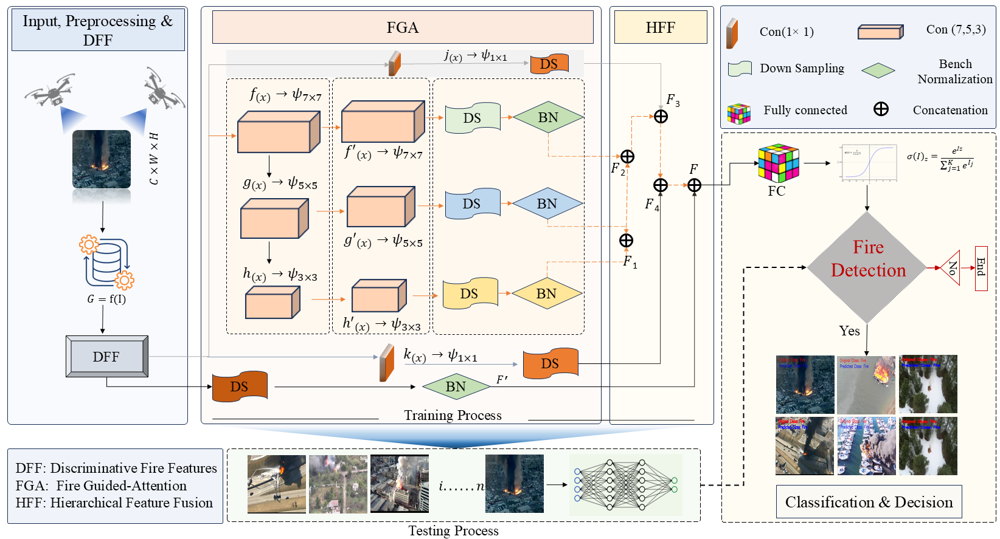

# Toward Intelligent Earth Observation: Hierarchical Feature Fusion and a Drone Dataset for UAV-Based Fire Detection
In UAV-based monitoring and remote sensing, early fire detection remains challenging due to the complex appearance, scale variation, and spatial ambiguity of fire scenes. Existing deep networks often rely heavily on feature maps from preceding layers, which can weaken fine-grained spatial representation and reduce detection accuracy, particularly for small, distant, or irregular fire regions. To address these limitations, we propose a Hierarchical Feature Fusion (HFF) framework that captures fire patterns across multiple scales. The proposed framework integrates Discriminative Fire Features (DFF) with a Fire-Guided Attention (FGA) module to refine hierarchical representations and improve sensitivity to varying fire intensities, distances, and scene conditions. In addition, to address the limited diversity of existing datasets, we introduce a new Drone Fire (DF) dataset containing a broad range of fire scenarios, geographic settings, and environmental conditions, while reducing class imbalance. Extensive experiments on four datasets, namely DF, FD, FLAME, and DSFD, show that HFF achieves accuracies of 89.16\%, 97.52\%, 97.50\%, and 96.00\%, respectively. The results demonstrate that the proposed framework provides reliable and robust performance across diverse UAV-based fire monitoring scenarios, making it well-suited for remote sensing applications in fire surveillance and disaster management.

## Framework


Overall architecture of the proposed HFF framework. Drone fire images are first preprocessed and passed to the DFF module for discriminative feature extraction. The extracted feature maps are then refined using the proposed fire guided-attention (FGA) module, which employs hierarchical multiscale attention to emphasize fire-relevant spatial regions. Subsequently, the refined features are integrated through the HFF module to combine local and global contextual information to obtain the best output.

## Dataset
Place your dataset in the dataset directory with the following structure:
```
dataset/
├── training/
│   ├── fire/
│   └── non_fire/
├── validation/
│   ├── fire/
│   └── non_fire/
└── testing/
    ├── fire/
    └── non_fire/
```
## 1 Paper Link 
Paper can be access through the [link](https://ieeexplore.ieee.org/abstract/document/11557121)
## 2 Dataset
The datasets can be downloaded from the following links

Option 1: The DF dataset Download from given link: Click [here](https://drive.google.com/file/d/1dLxg6DSz2jAmGYiOkRCWcAX14zT8XbBE/view?usp=sharing)


Option 2: Download FLAME’s dataset from the given link: Click [here](https://ieee-dataport.org/open-access/flame-dataset-aerial-imagery-pile-burn-detection-using-drones-uavs)

Option 3:  Downlod FD dataset from the given link Click [here](https://drive.google.com/drive/folders/14wGLPGCoJCPwfJY0PeK9tha64MqUF9iG?usp=sharing))
## 3 Citation and Acknowledgements
```
@article{danish2026toward,
  title={Toward Intelligent Earth Observation: Hierarchical Feature Fusion and a Drone Dataset for UAV-Based Fire Detection},
  author={Danish, Sufyan and Khan, Samee Ullah and Dang, L Minh and Song, Hyoung-Kyu and Moon, Hyeonjoon},
  journal={IEEE Journal of Selected Topics in Applied Earth Observations and Remote Sensing},
  year={2026},
  publisher={IEEE}
}
```
